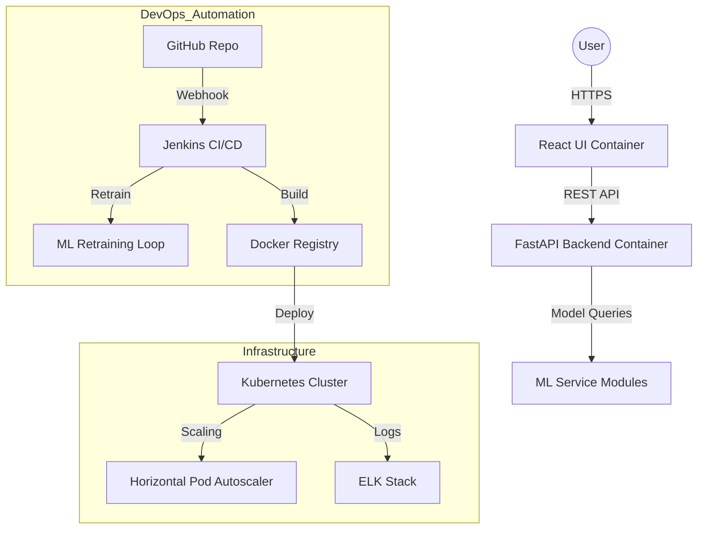

# CSE 816: Software Production Engineering Final Project Report
## Project Title: Medicine Price Tracker with Automated MLOps Pipeline
**Student Name:** Deeksha Jain  
**Domain:** MLOps and Software Production Engineering  

---

## 1. Executive Summary
The Medicine Price Tracker is a comprehensive DevOps-integrated platform designed to provide users with real-time medicine price comparisons, stockout risk assessments, and generic medicine alternatives. The project serves as a showcase for advanced Software Production Engineering (SPE) practices, implementing a fully automated CI/CD pipeline, containerized microservices, Kubernetes orchestration, and a specialized MLOps retraining loop.

---

## 2. Technology Stack
The project leverages a modern, industrial-grade tech stack:
- **Frontend**: React.js (Hooks, Context API, Vanilla CSS)
- **Backend**: FastAPI (Python), Uvicorn
- **Machine Learning**: Pandas, Scikit-learn, Numpy
- **CI/CD**: Jenkins, GitHub Webhooks, Ngrok
- **Containerization**: Docker, Docker Compose
- **Configuration Management**: Ansible
- **Orchestration**: Kubernetes (K8s), kubectl
- **Monitoring & Logging**: ELK Stack (Elasticsearch, Logstash, Kibana)
- **Communication**: SMTP (Gmail) for automated status notifications

---

## 3. Overall System Architecture
The system architecture follows a decoupled Microservices pattern, ensuring high availability, scalability, and ease of maintenance.

### 3.1 Architecture Diagram (Logical Flow)


### 3.2 Key Components
- **Client Layer**: A responsive React-based SPA that handles user interactions.
- **API Gateway Layer**: FastAPI backend managing business logic and ML service calls.
- **ML Engine**: Independent modules for predictive modeling and data analysis.
- **Automation Layer**: Jenkins orchestrating the lifecycle from code commit to deployment.
- **Infrastructure Layer**: Scalable containerized environment managed by Kubernetes.

---

## 4. MLOps (Machine Learning Operations) Implementation
The core innovation of this project is the automated MLOps pipeline.

### 4.1 Automated Retraining Logic
The pipeline automatically triggers a retraining script whenever the dataset is updated.
```python
# ml_service/train.py snippet
def train_models():
    df = pd.read_csv("data/medicine_dataset.csv")
    model = RandomForestRegressor()
    model.fit(X_train, y_train)
    pickle.dump(model, open("models/price_model.pkl", "wb"))
```

### 4.2 Jenkins MLOps Stage
```groovy
stage('MLOps Retraining Pipeline') {
    steps {
        script {
            sh '''
            cat <<EOF > Dockerfile.train
            FROM python:3.10
            RUN pip install pandas scikit-learn numpy
            RUN python ml_service/train.py
            EOF
            docker build -t ml-trainer -f Dockerfile.train .
            '''
        }
    }
}
```

---

## 5. CI/CD Pipeline Automation
The **Declarative Jenkins Pipeline** ensures that every change is tested and deployed without manual intervention.

### 5.1 Pipeline Overview
```groovy
pipeline {
    agent any
    triggers { githubPush() }
    stages {
        stage('Checkout') { steps { checkout scm } }
        stage('Install & Test') { steps { sh "pytest tests/" } }
        stage('Build & Push') { steps { sh "docker push ${IMAGE_NAME}" } }
        stage('Deploy to K8s') { steps { sh "./kubectl apply -f k8s/" } }
    }
    post {
        success { mail to: 'deeksha.jain2008@gmail.com', subject: 'Success!', body: 'Build Passed' }
    }
}
```

---

## 6. Containerization & Orchestration

### 6.1 Docker Orchestration (docker-compose.yml)
```yaml
services:
  backend:
    build: ./backend
    ports: ["8000:8000"]
  frontend:
    build: ./frontend
    ports: ["3000:80"]
  elasticsearch:
    image: elasticsearch:7.17.0
```

### 6.2 Kubernetes Scaling (HPA)
```yaml
# k8s/hpa.yaml
apiVersion: autoscaling/v2
kind: HorizontalPodAutoscaler
metadata:
  name: backend-hpa
spec:
  minReplicas: 2
  maxReplicas: 10
  metrics:
  - type: Resource
    resource:
      name: cpu
      target:
        type: Utilization
        averageUtilization: 50
```

---

## 7. Monitoring & Logging (ELK Stack)
Centralized logging is implemented using the **ELK Stack**:
- **Logstash**: Collects and parses logs from all containers.
- **Elasticsearch**: Indexes logs for high-speed searching.
- **Kibana**: Provides a dashboard for visualizing application health, search trends, and error rates.

---

## 8. Conclusion
This project demonstrates a complete, real-world DevOps framework. By integrating MLOps with modern software production engineering tools like Jenkins, Docker, and Kubernetes, the Medicine Price Tracker achieves a high level of automation, reliability, and professional standard.

---
*Report upgraded on: 2026-05-13*
